---
# try also 'default' to start simple
theme: default
# background: https://cover.sli.dev
# some information about your slides (markdown enabled)
title: What Engineering Leaders Can Learn from Social Network Analysis
info: |
  Presentation slides for What Engineering Leaders Can Learn from Social Network Analysis.

class: text-center
drawings:
  persist: false
# slide transition: https://sli.dev/guide/animations.html#slide-transitions
transition: slide-left
# enable Comark Syntax: https://comark.dev/syntax/markdown
comark: true
# duration of the presentation
duration: 20min
---

# Social Network Analysis for Engineering Leaders

---
transition: fade-out
class: text-center
---

# The Tooling

[geramirez/gh-graph-explorer](https://github.com/geramirez/gh-graph-explorer?tab=readme-ov-file#installation)

<!-- This is the link the Socal Network Analysis tool that I used to collect data  -->

---
transition: fade-out
---

# The Baby Manager

 

<!--
- Became a first time manager in 2024
- Excited and nervous, spent time reading about managment, taking the offical GitHub manager training, and talking to other managers.
- Still felt like I was missing something. Experinced managered knew:
  - who worked well together
  - which teams were close to other teams
  - the idea of the shadow org, how to get shit actually done
- I turned to what I knew - computational social sciences
-->

---
transition: fade-out
---
# Enter: Computational Social Sciences

 

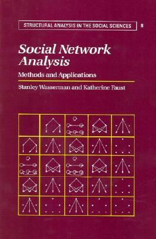

---
transition: fade-out
---

# Who am I and why Social Network Analysis?
 
 

### - First-time manager: Senior Engineering Manager at GitHub since 2024
### - Software Engineer Individual Contributor for 10 years. 

 
 

## In a past life... 

 
 

### - Computational Social Scientist 
### - Researched Social Networks in Social Media and Community Language Usage
### - Arabic Linguist (لسا بقدر احكي)

 
---
transition: fade-out
---

# Social Network Analysis (SNA) Origins?

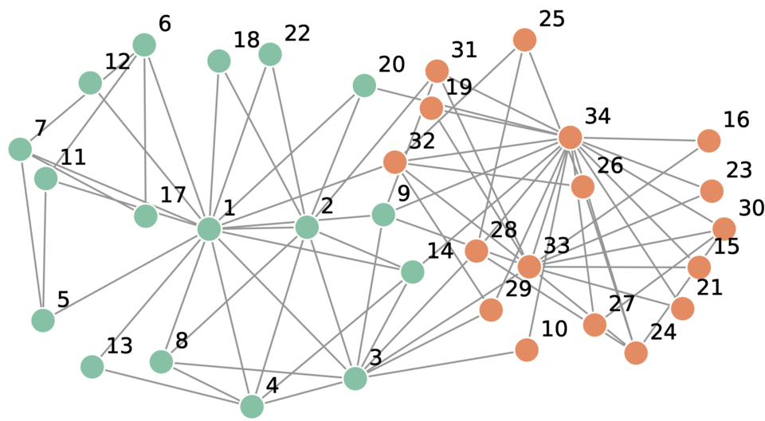

Zachary, W. W. (1977). "An Information Flow Model for Conflict and Fission in Small Groups". Journal of Anthropological Research. 33 (4): 452–473. doi:10.1086/jar.33.4.3629752.

<!--
- can be traced to the 1930s (sociometry)
- Method of analyzing social structures through the use of networks and graph theory.
- Was be difficult and time consuming because of computational limitations.
- The Image: One of the first real world studies was "Zachary's Karate Club" (1977) where the social network of a karate club was analyzed to predict a split in the club.
-->

---
transition: fade-out
---

# Social Network Analysis (SNA) Post Web 2.0?

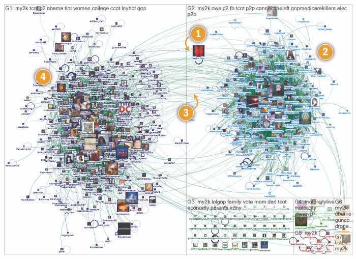
 

[Mapping Twitter Topic Networks: From Polarized Crowds to Community Clusters](https://www.pewresearch.org/internet/2014/02/20/mapping-twitter-topic-networks-from-polarized-crowds-to-community-clusters/)

<!--
- With the rise of Web 2.0 and Social Networks - Myspace, Facebook, Twitter and API Acccess - Social Network Analysis became more accessible and widely used in various fields.
- There is a large body of research on Social Network Analysis and Twitter. 
- The image is from a Pew Research Center study that analyzed Twitter topic networks in American politics. As is typical in political discussions, the network is highly polarized with two large clusters representing different political ideologies.
-->

---
transition: fade-out
---

# What can we learn with SNA in a work context?

 ### (if we trust the data)
  

- Group dyamics that are not visible in the organizational chart.
- Interpersonal Connections that are not broadcasted.
- Influencers (people front and center) and Connectors (people doing glue work)

 

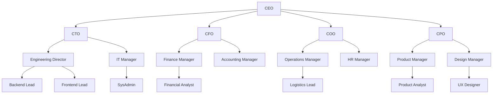

<!--

- Group dyamics that are not visible in the organizational chart.
- Interpersonal Connections that are not broadcast - for example, a silent contributors that works via 1-1s vs group meetings.
- Influencers and Connectors - people who are the center and those that connect different groups together.

-->

---
transition: fade-out
---

# What can we learn with SNA in a work context?

 ### (if we trust the data)
  

- Group dyamics that are not visible in the organizational chart.
- Interpersonal Connections that are not broadcasted.
- Influencers (people front and center) and Connectors (people doing glue work)

 

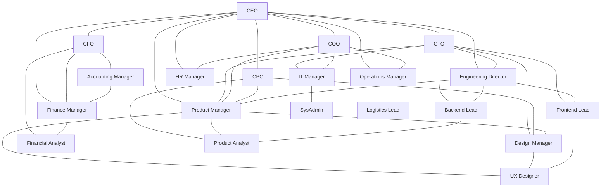

<!--

- Group dyamics that are not visible in the organizational chart.
- Interpersonal Connections that are not broadcast - for example, a silent contributors that works via 1-1s vs group meetings.
- Influencers and Connectors - people who are the center and those that connect different groups together.

-->

---
theme: default
drawings:
  persist: false
transition: slide-left
comark: true
class: text-center
---

# Applying SNA to my work as a manager

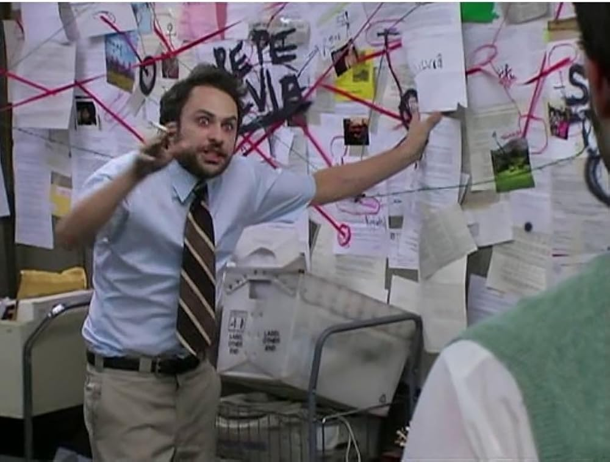

---
transition: fade-out
---

# Data Collection and Processing

- Started collecting data using a script similar to [gh-graph-explorer](https://github.com/geramirez/gh-graph-explorer) in January 2024. 
- Stored data in an csv edge list (usernames -- interaction -- GitHub Resource)
- Removed data points considered "fake collaboration" like weekly standup reports.
- At first clean up bots... but then decided to leave them. 

 
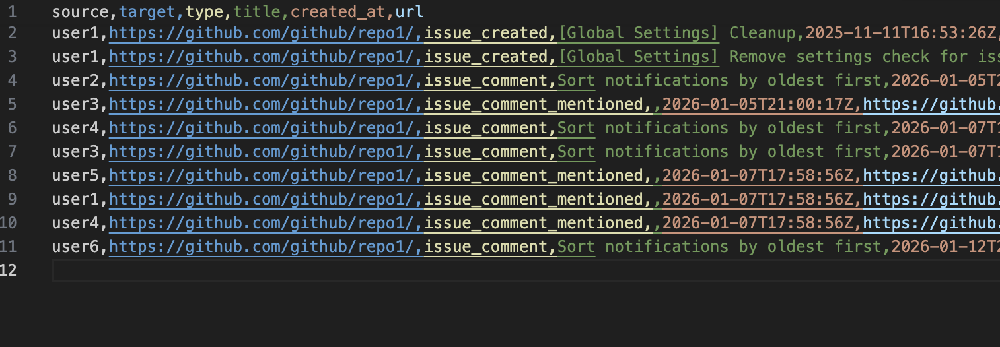

---
transition: fade-out
---

# Building The Network

## Bipartite Network

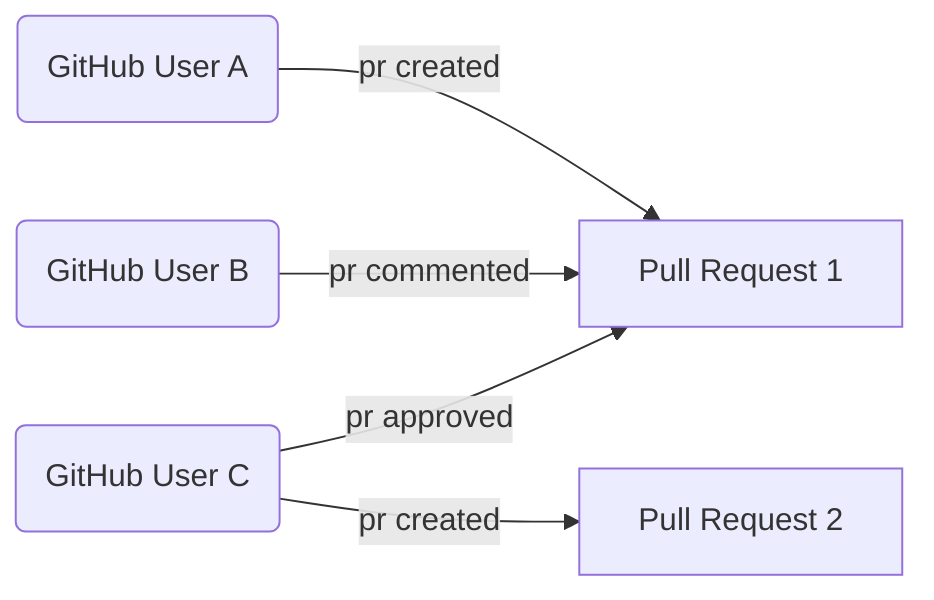

---
transition: fade-out
---

# Building The Network

## Collpased Bipartite Network

 

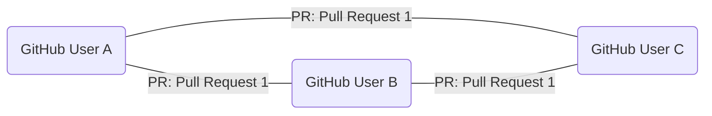

---
transition: fade-out
---

# Visualizing The Network

- Tools like [Gephi](https://gephi.org/), [vis-network](https://github.com/visjs/vis-network), [Cosmograph](https://cosmograph.app/), and [Neo4J](https://neo4j.com/)

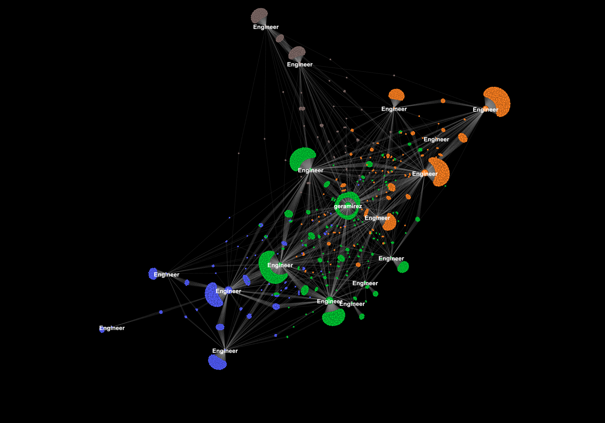

---
transition: fade-out
---
# Network Analysis
- Took bi-weekly measurments of the number of nodes, connectivity, and density of the network.
- Shared (network + group metrics graphs)

 

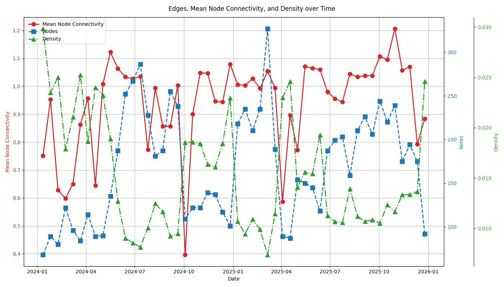

---
transition: fade-out
---
<!--
At it's best is a insights tool at worst it's a survailence tool. 

Sharing helps people understand how you use the data
-->

# AI

- Neo4J
- MCP server
- Claude Desktop 

---
transition: fade-out
---

# Engineer Manager Claude

- picture of my asking Claude to do x

---
transition: fade-out
---

# Pause

- picture of a stop sign
- just because we can, should we? 

---
transition: fade-out
---

# __Social__ Network Analysis

- Start with manager context, 1-1s, weekly updates, Slack conversations, Issues and PRs
- Use information to contextualize the network data

 

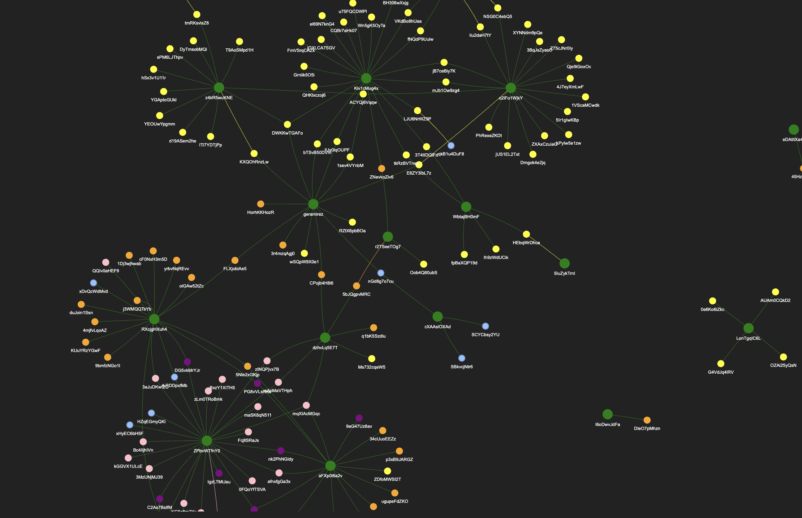

<!-- 
Without context, interpreations are worthless. SNA is not a shortcut to understanding your team, it's an enhancement. 
-->

---
transition: fade-out
---

# Learning Areas

 

## 1. Team On and Offboardings
 

## 2. Cliques and Silos
 

## 3. The Seniority Bottleneck
 

## 4. Manager Bottlenecks

---
transition: fade-out
---

# Team On and Offboardings

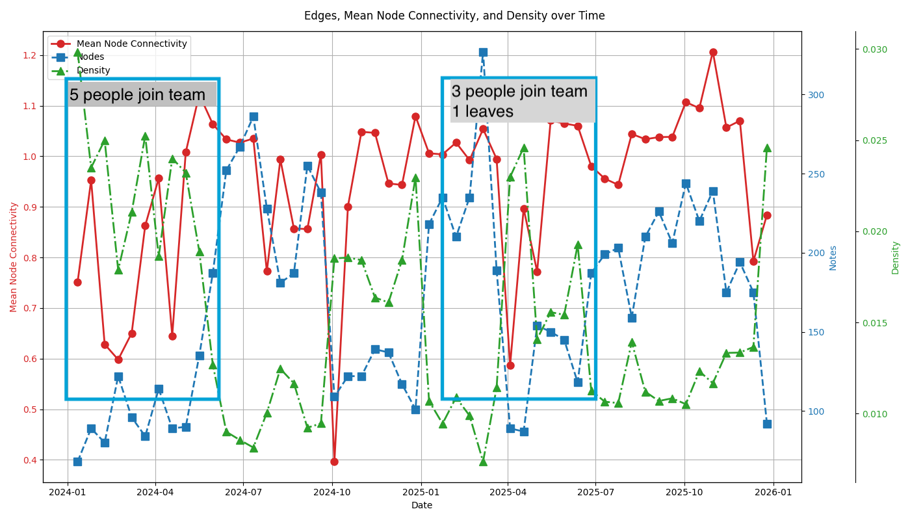

<!--
- it’s well documented that adding or removing people from a team affects team velocity.
- From the network perspective, something similar happens, the social network can also become more fragmented.
- I didn't start collecting on these people until 2-3 weeks after they joined
-->

---
transition: fade-out
---

# Team On and Offboardings Mitigations

- Buddy system 
- Onboarding Round Robins
- Fun activities 

<!--

- Buddy system - help people find someone to talk to 
- Onboarding Round Robins Build onboarding guide that requires 1-1s with team mates
-  Fun activities  - Allow for relationship building rather than just pushing people into a silo

-->

---
transition: fade-out
---

# Cliques and Silos

 
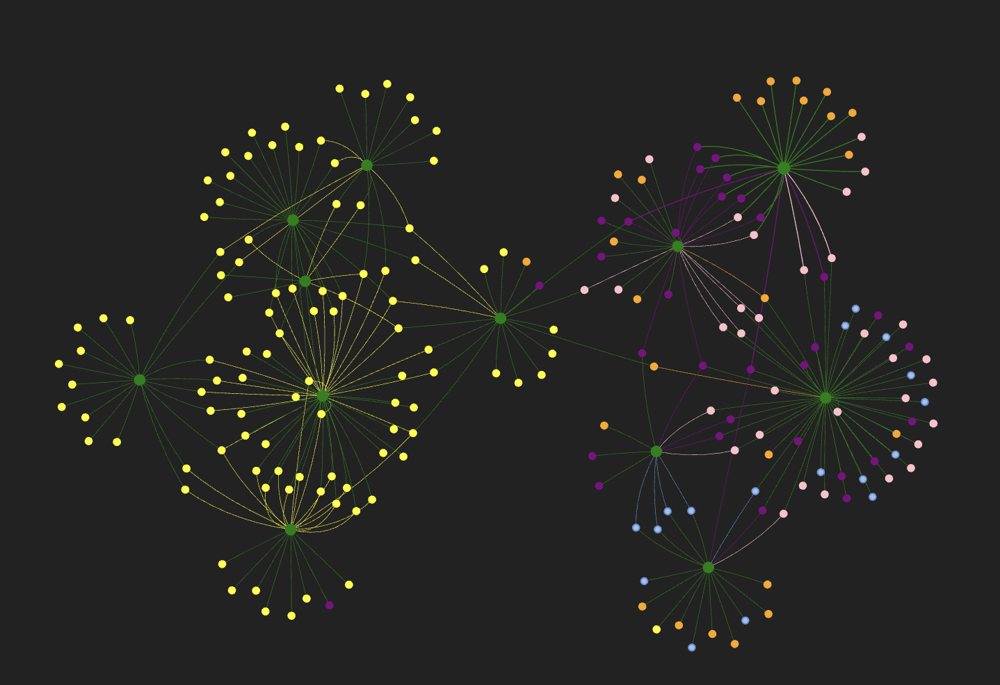

<!--
- Cliques and silos are when a group of people form tight-knit subgroups. 
- the Picture shows two of these silos
--> 

---
transition: fade-out
---

# Cliques and Silos Mitigations

- Are cliques and silos bad?
- When It's Positive - Encourage it let it be. Allow deep connections and work.
- When It's Determental - Rotations, cross-team projects, mob sessions

 

<!--
- These network proprties can be good or bad
- Bad: only a few people have information 
- Good: people are working very well together and sharing the load with a group of people
- They can also demonsrate a period of Sepicalized work or lack of cliques can show a period of Generalized work
- They can also be a sign of Deep work vs Cross-team work
--> 

---
transition: fade-out
---

# The Seniority Bottleneck

 
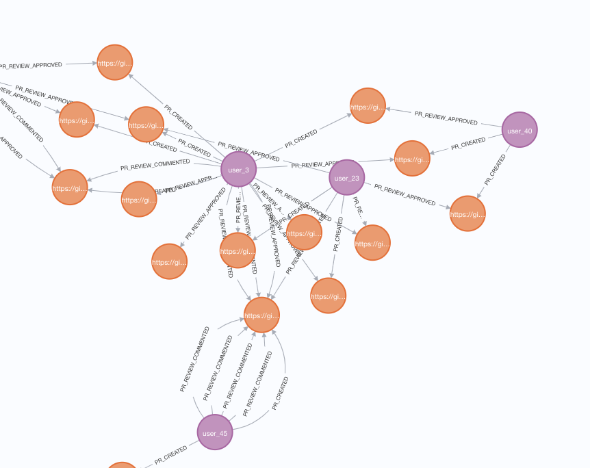

<!--
- senior engineers have richer networks: they have been at the organization, find it easier to reach out to others, or have more confidence when reviewing PR
- Their strong social ties are an asset, but they can also make it difficult for more junior engineers to meaningfully participate.
- Over the last two years, I tried a number of social experiments to nudge engineers closer together.
-->

---
transition: fade-out
---

# The Seniority Bottleneck Mitigations

- Mob Sessions
- Creating Junior-only Task Forces

 
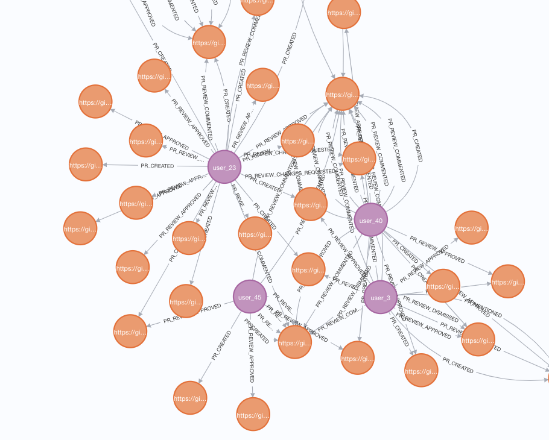

<!--
 allows juniors to build confidence, practice leadership and communication in a safer environment and a smaller scale. 
- Setting up Mob programming sessions: an easier way to generate group conversations and communication especially when you have an engaging facilitator
-->

---
transition: fade-out
---

# Manager Bottlenecks

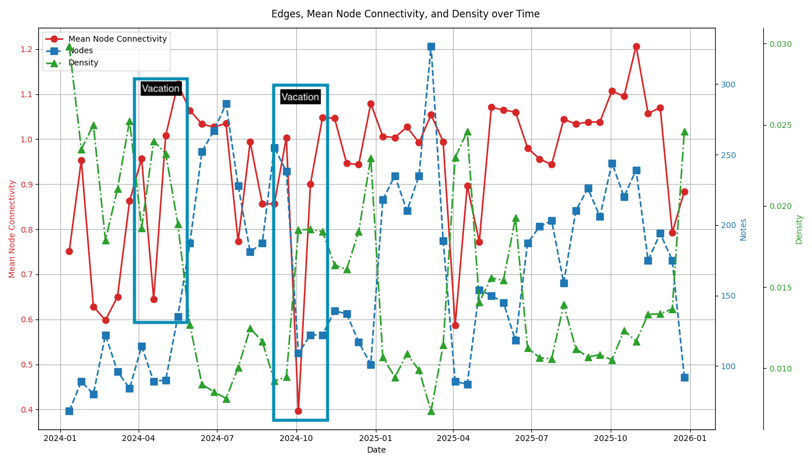

<!--
- sometimes the bottleneck can be a manager. 
- it's complicated because managers tend tob
-->

---
transition: fade-out
---

# Manager Bottlenecks Mitigations

- Encourage Decisions 
- Delegate Meeting Leadership 
- Encourage Continuity 

<!--
- Delegate Decisions  - can be hard to let go of
- Delegate meeting leadership - for example mob sessions or retros
- Encourage Continuity - if I'm not there, continue the meeting isn't about the manager it's about the team.
-->

---
transition: fade-out
---

# Performance Metrics? 
 
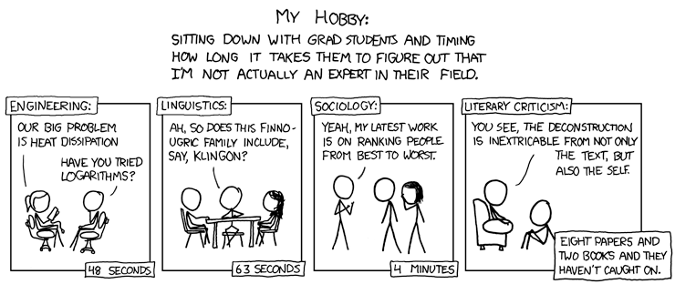

XKCD. (2013). "Impostor". XKCD. https://xkcd.com/149/

<!--
- With these insights, it can be tempting to turn social network analysis into a performance metric
- especially when we can easily use computational methods to calculate things like how central a person is to the network
-->

---
transition: fade-out
---

# Performance Metrics?

<v-clicks>

# NO

 

### Reasons for High Connectedness
- Leader
- Glue work
- Low value work

 

### Low Connection and Isolation Reasons
- Vacation
- Deep Work and Research 
- Personal Issues 

</v-clicks>

<!-- 
Low connectedness and isolation can have so many different interpretations and the tools we need to apply are rarely performance management.

1. People are on vacation: this can be positive, having a person who is a central node go on a two-week vacation can give the space for new connections to form.
2. People are working through something personal: as managers, if we see an isolated individual we should be curious first and see if we can support them 
3. Other reasons include burnout, wrong fit, or lack of skills: noticing a person is isolated is only the first step, we still need our other tools like 1:1s, coaching to navigate difficult situations
-->
 

---
transition: fade-out
---

# Performance Metrics or Leadership Report Cards?

<!--
If anything it's a performance metrics for us as leaders. Are we being good team custodians?
-->

---
transition: fade-out
---

# How to get Started with SNA?

[geramirez/gh-graph-explorer](https://github.com/geramirez/gh-graph-explorer?tab=readme-ov-file#installation)

---
transition: fade-out
---

# How to get Started with SNA?

## [Obsidan Graph View](https://obsidian.md/help/plugins/graph)

Using links you can map out connections during 1-1s, team meetings, or retrospectives.

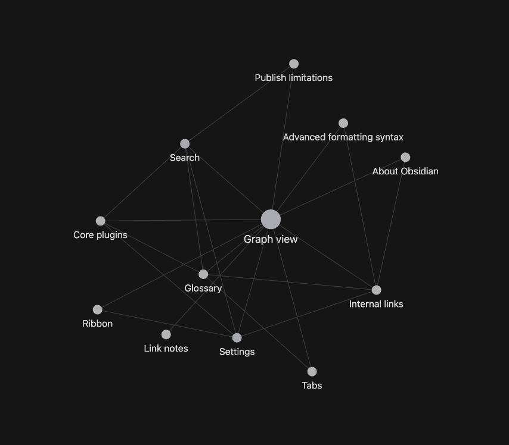

---
transition: fade-out
---

# How to get Started with SNA?

## Awareness
- Building an intuitive sense of the social networks around you. 
- Organization chart vs How Stuff Gets Done

---
transition: fade-out
---

# Thank you!
