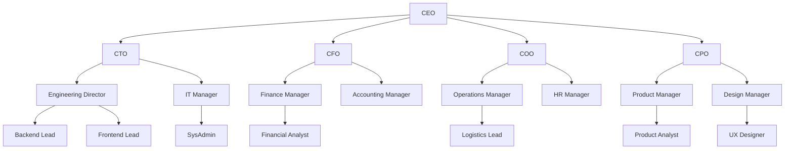
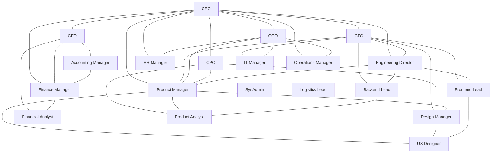
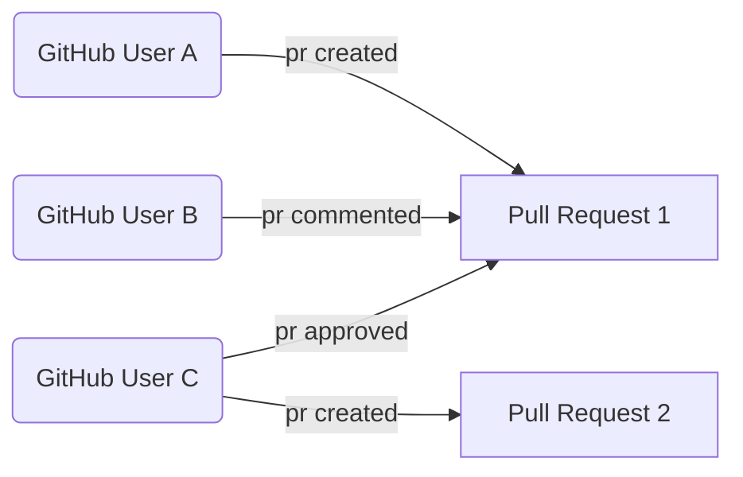
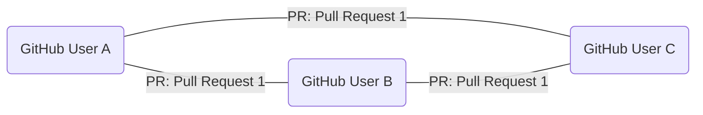
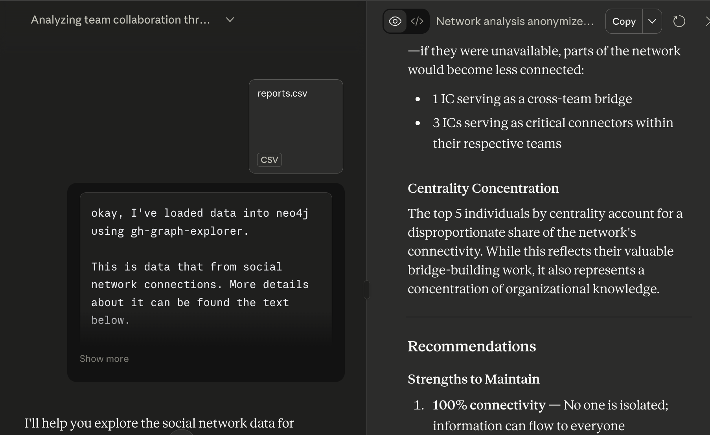
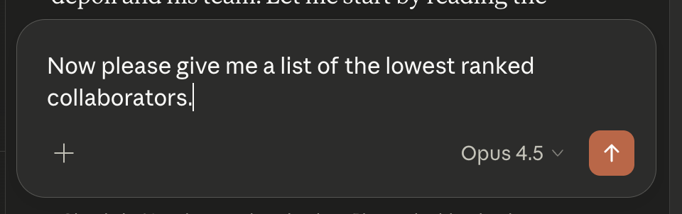

---
# try also 'default' to start simple
theme: default
# background: https://cover.sli.dev
# some information about your slides (markdown enabled)
title: What Engineering Leaders Can Learn from Social Network Analysis
info: |
  Presentation slides for What Engineering Leaders Can Learn from Social Network Analysis.

class: text-center
drawings:
  persist: false
# slide transition: https://sli.dev/guide/animations.html#slide-transitions
transition: slide-left
# enable Comark Syntax: https://comark.dev/syntax/markdown
comark: true
# duration of the presentation
duration: 20min
---

# Social Network Analysis for Engineering Leaders

---
transition: fade-out
---

# About me?

- Sociologist and Anthropologist turned software engineering
- Started my career as computational social scientist
- 15 years of experince in technology software engineering and engineering leadership

<!--
- I was stuyding sociology and anthropology in graduate school and roommate was a Computer Science PhD 
- One day I found him hunched over the computer wondering what his final project for his Network Analysis class. 
- What should I do for my network analysis final project? - There are a bunch of revolutions social movments
- brocast on twitter and I have do write my final paper too, let's work together?

- this kicked of my intrests in tech, started as a computational social scienist and slowly transition to software engineering and engineering leadership.
-->

---
transition: fade-out
---

# Why Social Network Analysis as an Engineering Manager?
- Understand my team from a different point of view
- Identify opportunities for improvement in my management practice
- Unspoken levers of of power and influence in an organization

---
transition: fade-out
layout: center
class: text-center
---

# Social Network Analysis, what is it?

---
transition: fade-out
---

# Social Network Analysis 101

 

- A research method for studying social structures through the use of networks and graph theory
- 1930s - during development of mass survey techniques and quantitative psychology
- Evolved alongside computing technology: from manual mapping to computational analysis

---
transition: fade-out
---

# Applying Social Network Analysis to Organizations

 

---
transition: fade-out
---

# What can we learn with SNA in a work context?

 

<!--
- Influencers and Connectors - people who are the center and those that connect different groups together.
- Group dyamics that are not visible in the organizational chart.
- Interpersonal Connections that are not broadcast - for example, a silent contributors that works via 1-1s vs group meetings.
-->

---
theme: default
drawings:
  persist: false
transition: slide-left
comark: true
class: text-center
---

# How I applied Social Network Analysis

---
transition: fade-out
---

# Data Collection and Processing

- Started collecting data using a script similar to [geramirez/gh-graph-explorer](https://github.com/geramirez/gh-graph-explorer) in January 2024. 
- Stored data in an csv edge list (usernames -- interaction -- GitHub Resource)

 

---
transition: fade-out
---

# What does the data look like?
 

## People to Resources (Bipartite Network)

---
transition: fade-out

---

# What does the data look like?

 

## People to People (Unipartite Network)

 

---
transition: fade-out
---

# Visualizing The Network

- Tools like [Gephi](https://gephi.org/), [vis-network](https://github.com/visjs/vis-network), [Cosmograph](https://cosmograph.app/), and [Neo4J](https://neo4j.com/)

 

---
transition: fade-out
---
# Network Analysis
- Capture network every 2 weeks
- Compute number of nodes, connectivity, and density of the network.

 

---
transition: fade-out
---

# Practical Team Management Insights

 

1. Team On and Offboardings
2. Cliques and Silos
3. The Seniority Bottleneck
4. Manager Bottlenecks

---
transition: fade-out
---

# Team On and Offboardings

- Team velocity drop when people join teams, so does the team connectivity.

<!--
- it’s well documented that adding or removing people from a team affects team velocity.
- From the network perspective, something similar happens, the social network can also become more fragmented.
- I didn't start collecting on these people until 2-3 weeks after they joined
-->

---
transition: fade-out
---

# Team On and Offboardings Mitigations

- Buddy system 
- Onboarding Round Robins
- Question of the Day or Game Days

<!--

- Buddy system - help people find someone to talk to 
- Onboarding Round Robins Build onboarding guide that requires 1-1s with team mates
-  Question of the Day or Game Days  - Allow for relationship building rather than just pushing people into a silo

-->

---
transition: fade-out
---

# Cliques and Silos

 

<!--
- Cliques and silos are when a group of people form tight-knit subgroups. 
- the Picture shows two of these silos
--> 

---
transition: fade-out
---

# Cliques and Silos Mitigations

- Are cliques and silos bad?
- When It's Positive - Encourage it let it be. Allow deep connections and work.
- When It's Detrimental - Rotations, cross-team projects, mob sessions

 

<!--
- These network proprties can be good or bad
- Bad: only a few people have information 
- Good: people are working very well together and sharing the load with a group of people
- They can also demonsrate a period of Sepicalized work or lack of cliques can show a period of Generalized work
- They can also be a sign of Deep work vs Cross-team work
--> 

---
transition: fade-out
---

# The Seniority Bottleneck

 

<!--
- senior engineers have richer networks: they have been at the organization, find it easier to reach out to others, or have more confidence when reviewing PR
- Their strong social ties are an asset, but they can also make it difficult for more junior engineers to meaningfully participate.
- Over the last two years, I tried a number of social experiments to nudge engineers closer together.
-->

---
transition: fade-out
---

# The Seniority Bottleneck Mitigations

- Mob Sessions
- Creating Junior-only Task Forces

 

<!--
 allows juniors to build confidence, practice leadership and communication in a safer environment and a smaller scale. 
- Setting up Mob programming sessions: an easier way to generate group conversations and communication especially when you have an engaging facilitator
-->

---
transition: fade-out
---

# Manager Bottlenecks

<!--
- sometimes the bottleneck can be a manager. 
- it's complicated because managers tend tob
-->

---
transition: fade-out
---

# Manager Bottlenecks Mitigations

- Encourage Autonomous Decisions 
- Delegate Meeting Leadership 
- Encourage Continuity

<!--
- Encourage Autonomous Decisions   - can be hard to let go of
- Delegate meeting leadership - for example mob sessions or retros
- Encourage Continuity - if I'm not there, continue the meeting isn't about the manager it's about the team.
-->

---
transition: fade-out
---

# Social Network Analysis with AI?

  
  
  

<!--
Yes, we can use AI to automate the process of collecting, analyzing, and visualizing social network data.
- Neo4J has a graph database that can be used to store and query social network data
- Model Context Protocol (MCP) can be used to provide context to the AI 
- Claude Desktop can be used to interact with the AI and get insights from the data
-->

---
transition: fade-out
---

# Engineer Manager Claude
- anonymized org chart + MCP server

---
transition: fade-out
---

# Engineer Manager Claude

---
transition: fade-out
---

# Pause

<!--
- For anyone that has done softare engineering with AI, you know that building complexity is easier than ever. 
- In the recent past when you had to manually code line by line, you had time to think about if the thing your building makes sense. 
- The same applies in this case. Using AI to automate difficult managerial tasks is becoming easier.
- But we should pause and think about the implications, ethics, and limits of what we are doing. 
-->

---
transition: fade-out
---

# Rewind

<svg xmlns="http://www.w3.org/2000/svg" viewBox="0 0 100 100" style="width: 200px; height: auto; display: block; margin: 2rem auto;">
  <polygon points="10,50 50,10 50,90" fill="#333"/>
  <polygon points="50,50 90,10 90,90" fill="#333"/>
</svg>

<!--
- In the 1930 when quantitive social research was really exciting; however,
- by the end of the decade and into the 1940s, there were serious ethical concerns about quatitiative methods 

Sociologist espeically those that had seen WWII, eugenics and genocide. 
In the effort to understand society better through science and quantitive methods
we created dangerous and biased ideas "backed by data"

I think in some ways with the ease of which we can do social network analysis and query AI, we are back in that time again.

-->

---
transition: fade-out
---

# Ethical Considerations

- In Academia this would require Institutional Review Boards (also a product of post-WWII ethical concerns in research)
- As a manager you have much more access to personal and senstive data about your team, and you have a lot of power over them... use it responsibly.

 

---
transition: fade-out
---

# Personal Ethical Principles

- **Transparency**
  - People should know that their interactions are being analyzed and how it's used. 
  - Share metrics and insights with the team
- **Not a stand-alone tool**
  - SNA should be used to understand team dynamics, not to evaluate individual performance.
- **Bias and Fairness**
  - Be aware of potential biases in data collection and analysis.

---
transition: fade-out
---

# Context Matters

### Reasons for High Connectedness

 

- Leader (influencer)
- Glue work (connector)
- Low value work (low-value contributions or others need to do their work)

<!-- 
Low connectedness and isolation can have so many different interpretations and the tools we need to apply are rarely performance management.

1. People are on vacation: this can be positive, having a person who is a central node go on a two-week vacation can give the space for new connections to form.
2. People are working through something personal: as managers, if we see an isolated individual we should be curious first and see if we can support them 
3. Other reasons include burnout, wrong fit, or lack of skills: noticing a person is isolated is only the first step, we still need our other tools like 1:1s, coaching to navigate difficult situations
-->
 
---
transition: fade-out
---

# Context Matters

### Low Connectedness and Isolation Reasons

 

- Vacation
- Deep Work and Research 
- Interpersonal conflicts

<!-- 
Low connectedness and isolation can have so many different interpretations and the tools we need to apply are rarely performance management.

1. People are on vacation: this can be positive, having a person who is a central node go on a two-week vacation can give the space for new connections to form.
2. People are working through something personal: as managers, if we see an isolated individual we should be curious first and see if we can support them 
3. Other reasons include burnout, wrong fit, or lack of skills: noticing a person is isolated is only the first step, we still need our other tools like 1:1s, coaching to navigate difficult situations
-->
 

---
transition: fade-out
---

# The Network Needs a Manager

Social Network Analysis clarifies a snapshot of interactions. It doesn't tell you why or what to do about it.

- 1-1s: surface topics that can't be graphed
- Retrospectives: help us decide what should happen
- Coaching and Mentorship: requires interpersonal connection and trust

 

<!-- 
Without context, interpreations are worthless. SNA is not a shortcut to understanding your team. 
-->

---
transition: fade-out
---

# Thank you!
