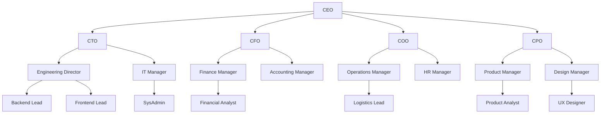
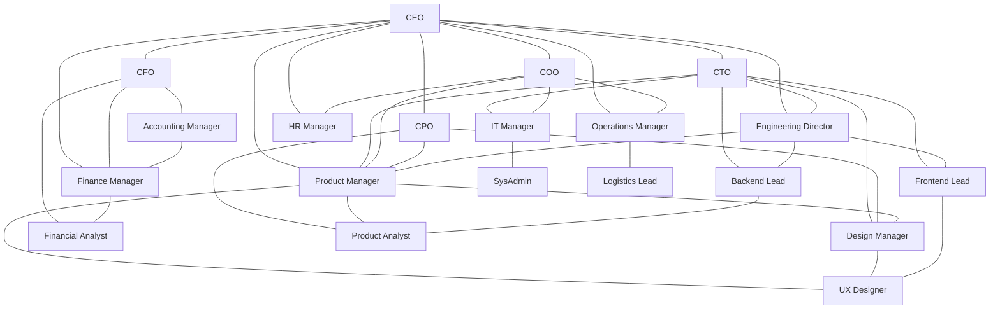
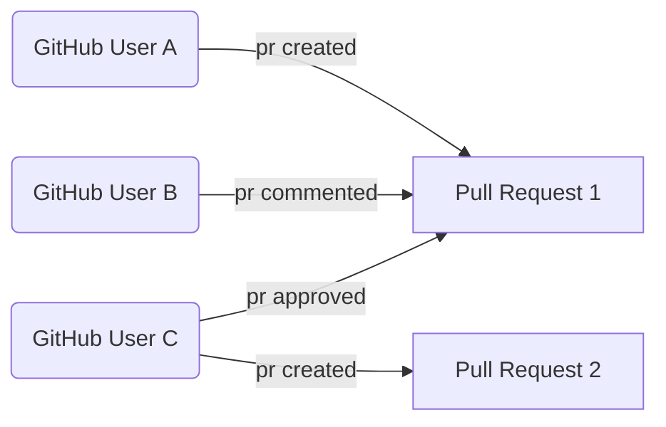
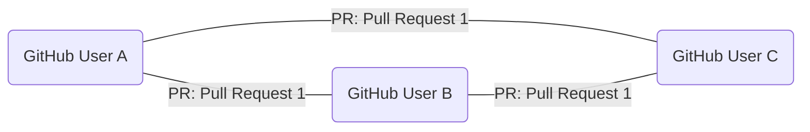

---
# try also 'default' to start simple
theme: default
# background: https://cover.sli.dev
# some information about your slides (markdown enabled)
title: What Engineering Leaders Can Learn from Social Network Analysis
info: |
  Presentation slides for What Engineering Leaders Can Learn from Social Network Analysis.

class: text-center
drawings:
  persist: false
# slide transition: https://sli.dev/guide/animations.html#slide-transitions
transition: slide-left
# enable Comark Syntax: https://comark.dev/syntax/markdown
comark: true
# duration of the presentation
duration: 20min
---

# Social Network Analysis for Engineering Leaders

---
transition: fade-out
---

# About me

- Sociologist and Anthropologist turned software engineering
- Started my career as computational social scientist
- 15 years of experience in technology software engineering and engineering leadership
- Currently at GitHub 

<!--
- I was stuyding sociology and anthropology in graduate school and roommate was a Computer Science PhD 
- One day I found him hunched over the computer wondering what his final project for his Network Analysis class. 
- What should I do for my network analysis final project? - There are a bunch of revolutions social movments
- brocast on twitter and I have do write my final paper too, let's work together?

- this kicked of my intrests in tech, started as a computational social scienist and slowly transition to software engineering and engineering leadership.
-->

---
transition: fade-out
layout: center
class: text-center
---

# Social Network Analysis, what is it?

---
transition: fade-out
---

# Social Network Analysis 101

 

- A research method for studying social structures through the use of networks and graph theory
- 1930s - during development of mass survey techniques and quantitative psychology
- Evolved alongside computing technology: from manual mapping to computational analysis

<!--
- came about in 1930, during a time when we were starting to collect a lot of data on people.
-->

---
transition: fade-out
---

# Why Social Network Analysis as an Engineering Manager?
- Understand my team from a different point of view
- Identify opportunities for improvement in my management practice
- Unspoken levers of of power and influence in an organization

---
transition: fade-out
---

# Applying Social Network Analysis to Organizations

 

<!--
- Typically we see the org chart
-->

---
transition: fade-out
---

# What can we learn with SNA in a work context?

 

<!--
- Influencers and Connectors - people who are the center and those that connect different groups together.
- Group dyamics that are not visible in the organizational chart.
- Interpersonal Connections that are not broadcast - for example, a silent contributors that works via 1-1s vs group meetings.
-->

---
theme: default
drawings:
  persist: false
transition: slide-left
comark: true
class: text-center
---

# How I applied Social Network Analysis

---
transition: fade-out
---

# Data Collection and Processing

- Started collecting data using a script similar to [geramirez/gh-graph-explorer](https://github.com/geramirez/gh-graph-explorer) in January 2024. 
- Stored data in an csv edge list (usernames -- interaction -- GitHub Resource)

 

---
transition: fade-out
---

# What does the network graph look like?
 

## People to Resources (Bipartite Network)

<!--
This is an interesting way to analyze data because it links people to the topics they work on
-->

---
transition: fade-out
---

# What does the data look like?

 

## People to People (Unipartite Network)

 

<!--
This is really useful for seeing how people directly interact, outside of the topics they are working on
-->

---
transition: fade-out
---

# Visualizing The Network

- Tools like [Gephi](https://gephi.org/), [vis-network](https://github.com/visjs/vis-network), [Cosmograph](https://cosmograph.app/), and [Neo4J](https://neo4j.com/)

 

---
transition: fade-out
---

# Computational Network Analysis
- Capture network every 2 weeks
- Compute number of nodes, connectivity, and density of the network.

 

<!--
what you see is a rich story over time
-->

---
transition: fade-out
---

# Practical Team Management Insights

 

1. Team On and Offboardings
2. Cliques and Silos
3. The Seniority Bottleneck
4. Manager Bottlenecks

---
transition: fade-out
---

# Team On and Offboardings

- Team velocity drop when people join teams, so does the team connectivity.

<!--
- it’s well documented that adding or removing people from a team affects team velocity.
- From the network perspective, something similar happens, the social network can also become more fragmented.
- I didn't start collecting on these people until 2-3 weeks after they joined
-->

---
transition: fade-out
---

# Mitigations: Buddy System

- Help people find someone to talk to 

 
<svg viewBox="0 0 300 300" style="width: 18em; max-width: 100%; max-height: 280px; display: block; margin: 0 auto;">
  <!-- Pair connections -->
  <g stroke="#4a90d9" stroke-width="2.5" opacity="0.6">
    <line x1="60" y1="40" x2="160" y2="80"/>
    <line x1="200" y1="30" x2="260" y2="120"/>
    <line x1="30" y1="150" x2="130" y2="200"/>
    <line x1="170" y1="170" x2="270" y2="230"/>
    <line x1="80" y1="260" x2="200" y2="270"/>
  </g>
  <!-- Pair 1: top-left, angled down-right -->
  <circle cx="60" cy="40" r="18" fill="#4a90d9" opacity="0.9"/>
  <circle cx="160" cy="80" r="18" fill="#4a90d9" opacity="0.9"/>
  <!-- Pair 2: top-right, angled down -->
  <circle cx="200" cy="30" r="18" fill="#6a9fb5" opacity="0.9"/>
  <circle cx="260" cy="120" r="18" fill="#6a9fb5" opacity="0.9"/>
  <!-- Pair 3: mid-left, angled down-right -->
  <circle cx="30" cy="150" r="18" fill="#4a90d9" opacity="0.9"/>
  <circle cx="130" cy="200" r="18" fill="#4a90d9" opacity="0.9"/>
  <!-- Pair 4: mid-right, angled down-right -->
  <circle cx="170" cy="170" r="18" fill="#6a9fb5" opacity="0.9"/>
  <circle cx="270" cy="230" r="18" fill="#6a9fb5" opacity="0.9"/>
  <!-- Pair 5: bottom, angled right -->
  <circle cx="80" cy="260" r="18" fill="#4a90d9" opacity="0.9"/>
  <circle cx="200" cy="270" r="18" fill="#4a90d9" opacity="0.9"/>
</svg>

<!--
- Buddy system - help people find someone to talk to 
-->

---
transition: fade-out
---

# Mitigations: Onboarding Round Robins

- Build onboarding guide that requires 1-1s with team mates

 
<svg viewBox="0 0 400 400" style="width: 22em; max-width: 100%; display: block; margin: 0 auto;">
  <!-- Edges: all 28 connections between 8 nodes -->
  <g stroke="#6a9fb5" stroke-width="1" opacity="0.4">
    <line x1="200" y1="50" x2="306" y2="89"/>
    <line x1="200" y1="50" x2="350" y2="200"/>
    <line x1="200" y1="50" x2="306" y2="311"/>
    <line x1="200" y1="50" x2="200" y2="350"/>
    <line x1="200" y1="50" x2="94" y2="311"/>
    <line x1="200" y1="50" x2="50" y2="200"/>
    <line x1="306" y1="89" x2="350" y2="200"/>
    <line x1="306" y1="89" x2="306" y2="311"/>
    <line x1="306" y1="89" x2="200" y2="350"/>
    <line x1="306" y1="89" x2="94" y2="311"/>
    <line x1="306" y1="89" x2="50" y2="200"/>
    <line x1="350" y1="200" x2="306" y2="311"/>
    <line x1="350" y1="200" x2="200" y2="350"/>
    <line x1="350" y1="200" x2="94" y2="311"/>
    <line x1="350" y1="200" x2="50" y2="200"/>
    <line x1="306" y1="311" x2="200" y2="350"/>
    <line x1="306" y1="311" x2="94" y2="311"/>
    <line x1="306" y1="311" x2="50" y2="200"/>
    <line x1="200" y1="350" x2="94" y2="311"/>
    <line x1="200" y1="350" x2="50" y2="200"/>
    <line x1="94" y1="311" x2="50" y2="200"/>
    <line x1="200" y1="50" x2="94" y2="89"/>
    <line x1="306" y1="89" x2="94" y2="89"/>
    <line x1="350" y1="200" x2="94" y2="89"/>
    <line x1="306" y1="311" x2="94" y2="89"/>
    <line x1="200" y1="350" x2="94" y2="89"/>
    <line x1="94" y1="311" x2="94" y2="89"/>
    <line x1="50" y1="200" x2="94" y2="89"/>
  </g>
  <!-- Nodes arranged in octagon -->
  <g>
    <circle cx="200" cy="50" r="22" fill="#4a90d9" opacity="0.9"/>
    <circle cx="306" cy="89" r="22" fill="#4a90d9" opacity="0.9"/>
    <circle cx="350" cy="200" r="22" fill="#4a90d9" opacity="0.9"/>
    <circle cx="306" cy="311" r="22" fill="#4a90d9" opacity="0.9"/>
    <circle cx="200" cy="350" r="22" fill="#4a90d9" opacity="0.9"/>
    <circle cx="94" cy="311" r="22" fill="#4a90d9" opacity="0.9"/>
    <circle cx="50" cy="200" r="22" fill="#4a90d9" opacity="0.9"/>
    <circle cx="94" cy="89" r="22" fill="#4a90d9" opacity="0.9"/>
  </g>
</svg>

<!--
- Onboarding Round Robins Build onboarding guide that requires 1-1s with team mates
-->

---
transition: fade-out
---

# Mitigations: Question of the Day / Game Days

- Allow for relationship building rather than just pushing people into a silo

 
<svg viewBox="0 0 300 300" style="width: 18em; max-width: 100%; max-height: 280px; display: block; margin: 0 auto;">
  <!-- Edges from center to outer nodes -->
  <g stroke="#e8a838" stroke-width="2.5" opacity="0.6">
    <line x1="150" y1="150" x2="150" y2="25"/>
    <line x1="150" y1="150" x2="269" y2="68"/>
    <line x1="150" y1="150" x2="269" y2="232"/>
    <line x1="150" y1="150" x2="150" y2="275"/>
    <line x1="150" y1="150" x2="31" y2="232"/>
    <line x1="150" y1="150" x2="31" y2="68"/>
    <line x1="150" y1="150" x2="275" y2="150"/>
  </g>
  <!-- Outer nodes -->
  <g>
    <circle cx="150" cy="25" r="18" fill="#e8a838" opacity="0.9"/>
    <circle cx="269" cy="68" r="18" fill="#e8a838" opacity="0.9"/>
    <circle cx="275" cy="150" r="18" fill="#e8a838" opacity="0.9"/>
    <circle cx="269" cy="232" r="18" fill="#e8a838" opacity="0.9"/>
    <circle cx="150" cy="275" r="18" fill="#e8a838" opacity="0.9"/>
    <circle cx="31" cy="232" r="18" fill="#e8a838" opacity="0.9"/>
    <circle cx="31" cy="68" r="18" fill="#e8a838" opacity="0.9"/>
  </g>
  <!-- Center node with emoji -->
  <circle cx="150" cy="150" r="28" fill="#d94a4a" opacity="0.9"/>
  <text x="150" y="158" text-anchor="middle" font-size="22">🎮</text>
</svg>

<!--
- Question of the Day or Game Days - Allow for relationship building rather than just pushing people into a silo
-->

---
transition: fade-out
---

# Cliques and Silos

 

<!--
- Cliques and silos are when a group of people form tight-knit subgroups. 
- the Picture shows two of these silos
--> 

---
transition: fade-out
---

# Mitigations: Are Cliques and Silos Bad?

- Are cliques and silos bad?

 
<svg viewBox="0 0 340 250" style="width: 20em; max-width: 100%; max-height: 260px; display: block; margin: 0 auto;">
  <!-- Edges: all 6 connections between 4 nodes -->
  <g stroke="#4a90d9" stroke-width="2" opacity="0.5">
    <line x1="60" y1="60" x2="200" y2="60"/>
    <line x1="60" y1="60" x2="60" y2="190"/>
    <line x1="60" y1="60" x2="200" y2="190"/>
    <line x1="200" y1="60" x2="60" y2="190"/>
    <line x1="200" y1="60" x2="200" y2="190"/>
    <line x1="60" y1="190" x2="200" y2="190"/>
  </g>
  <!-- 4 nodes -->
  <circle cx="60" cy="60" r="18" fill="#4a90d9" opacity="0.9"/>
  <circle cx="200" cy="60" r="18" fill="#4a90d9" opacity="0.9"/>
  <circle cx="60" cy="190" r="18" fill="#4a90d9" opacity="0.9"/>
  <circle cx="200" cy="190" r="18" fill="#4a90d9" opacity="0.9"/>
  <!-- Question mark -->
  <text x="280" y="140" text-anchor="middle" font-size="30" fill="#e8a838">❓</text>
</svg>

<!--
- These network properties can be good or bad
-->

---
transition: fade-out
---

# Mitigations: When It's Positive

- Encourage it, let it be. Allow deep connections and work.

 
<svg viewBox="0 0 340 250" style="width: 20em; max-width: 100%; max-height: 260px; display: block; margin: 0 auto;">
  <!-- Edges: all 6 connections between 4 nodes -->
  <g stroke="#4a90d9" stroke-width="2" opacity="0.5">
    <line x1="60" y1="60" x2="200" y2="60"/>
    <line x1="60" y1="60" x2="60" y2="190"/>
    <line x1="60" y1="60" x2="200" y2="190"/>
    <line x1="200" y1="60" x2="60" y2="190"/>
    <line x1="200" y1="60" x2="200" y2="190"/>
    <line x1="60" y1="190" x2="200" y2="190"/>
  </g>
  <!-- 4 nodes -->
  <circle cx="60" cy="60" r="18" fill="#4a90d9" opacity="0.9"/>
  <circle cx="200" cy="60" r="18" fill="#4a90d9" opacity="0.9"/>
  <circle cx="60" cy="190" r="18" fill="#4a90d9" opacity="0.9"/>
  <circle cx="200" cy="190" r="18" fill="#4a90d9" opacity="0.9"/>
  <!-- Green checkmark -->
  <text x="280" y="140" text-anchor="middle" font-size="25" fill="#4caf50">✅</text>
</svg>

<!--
When it might be good
- the team is really big and area is large
- topic is difficult and specialized and there is high context bar
    - AI integration for slack and teams and another working on a complex database cluster deprecation
-->

---
transition: fade-out
---

# Mitigations: When It's Detrimental

- Identify when silos are blocking collaboration

 
<svg viewBox="0 0 340 250" style="width: 20em; max-width: 100%; max-height: 260px; display: block; margin: 0 auto;">
  <!-- Edges: all 6 connections between 4 nodes -->
  <g stroke="#d94a4a" stroke-width="2" opacity="0.5">
    <line x1="60" y1="60" x2="200" y2="60"/>
    <line x1="60" y1="60" x2="60" y2="190"/>
    <line x1="60" y1="60" x2="200" y2="190"/>
    <line x1="200" y1="60" x2="60" y2="190"/>
    <line x1="200" y1="60" x2="200" y2="190"/>
    <line x1="60" y1="190" x2="200" y2="190"/>
  </g>
  <!-- 4 nodes -->
  <circle cx="60" cy="60" r="18" fill="#d94a4a" opacity="0.9"/>
  <circle cx="200" cy="60" r="18" fill="#d94a4a" opacity="0.9"/>
  <circle cx="60" cy="190" r="18" fill="#d94a4a" opacity="0.9"/>
  <circle cx="200" cy="190" r="18" fill="#d94a4a" opacity="0.9"/>
  <!-- Health icon -->
  <text x="280" y="140" text-anchor="middle" font-size="30" fill="#d94a4a">🏥</text>
</svg>

<!--
- Bad: only a few people have information, silos block knowledge sharing
-->

---
transition: fade-out
---

# Mitigations: Rotations

- Rotate team members between groups to break silos

 
<svg viewBox="0 0 400 250" style="width: 22em; max-width: 100%; max-height: 260px; display: block; margin: 0 auto;">
  <!-- Group 1 edges -->
  <g stroke="#4a90d9" stroke-width="2" opacity="0.4">
    <line x1="30" y1="60" x2="120" y2="60"/>
    <line x1="30" y1="60" x2="30" y2="170"/>
    <line x1="30" y1="60" x2="120" y2="170"/>
    <line x1="120" y1="60" x2="30" y2="170"/>
    <line x1="120" y1="60" x2="120" y2="170"/>
    <line x1="30" y1="170" x2="120" y2="170"/>
  </g>
  <!-- Group 2 edges -->
  <g stroke="#e8a838" stroke-width="2" opacity="0.4">
    <line x1="280" y1="60" x2="370" y2="60"/>
    <line x1="280" y1="60" x2="280" y2="170"/>
    <line x1="280" y1="60" x2="370" y2="170"/>
    <line x1="370" y1="60" x2="280" y2="170"/>
    <line x1="370" y1="60" x2="370" y2="170"/>
    <line x1="280" y1="170" x2="370" y2="170"/>
  </g>
  <!-- Group 1 nodes -->
  <circle cx="30" cy="60" r="16" fill="#4a90d9" opacity="0.9"/>
  <circle cx="120" cy="60" r="16" fill="#e8a838" opacity="0.9" stroke="#e8a838" stroke-width="2"/>
  <circle cx="30" cy="170" r="16" fill="#4a90d9" opacity="0.9"/>
  <circle cx="120" cy="170" r="16" fill="#4a90d9" opacity="0.9"/>
  <!-- Group 2 nodes -->
  <circle cx="280" cy="60" r="16" fill="#4a90d9" opacity="0.9" stroke="#4a90d9" stroke-width="2"/>
  <circle cx="370" cy="60" r="16" fill="#e8a838" opacity="0.9"/>
  <circle cx="280" cy="170" r="16" fill="#e8a838" opacity="0.9"/>
  <circle cx="370" cy="170" r="16" fill="#e8a838" opacity="0.9"/>
  <!-- Swap arrows -->
  <g fill="none" stroke="#888" stroke-width="2">
    <path d="M 140,55 C 180,20 220,20 260,55" marker-end="url(#arrowhead)"/>
    <path d="M 260,75 C 220,110 180,110 140,75" marker-end="url(#arrowhead)"/>
  </g>
  <defs>
    <marker id="arrowhead" markerWidth="8" markerHeight="6" refX="8" refY="3" orient="auto">
      <polygon points="0 0, 8 3, 0 6" fill="#888"/>
    </marker>
  </defs>
</svg>

<!--
- Rotate people between teams to cross-pollinate knowledge
    - I rotated staff + junior engineers, same onboarding process
-->

---
transition: fade-out
---

# Mitigations: Cross-Team Projects

- Shared projects create bridges between silos

 
<svg viewBox="0 0 300 280" style="width: 18em; max-width: 100%; max-height: 270px; display: block; margin: 0 auto;">
  <!-- Edges from mob center to all nodes -->
  <g stroke="#6a9fb5" stroke-width="2" opacity="0.5">
    <line x1="150" y1="140" x2="150" y2="20"/>
    <line x1="150" y1="140" x2="255" y2="55"/>
    <line x1="150" y1="140" x2="280" y2="140"/>
    <line x1="150" y1="140" x2="255" y2="225"/>
    <line x1="150" y1="140" x2="150" y2="260"/>
    <line x1="150" y1="140" x2="45" y2="225"/>
    <line x1="150" y1="140" x2="20" y2="140"/>
    <line x1="150" y1="140" x2="45" y2="55"/>
  </g>
  <!-- Outer nodes -->
  <circle cx="150" cy="20" r="14" fill="#4a90d9" opacity="0.9"/>
  <circle cx="255" cy="55" r="14" fill="#e8a838" opacity="0.9"/>
  <circle cx="280" cy="140" r="14" fill="#4a90d9" opacity="0.9"/>
  <circle cx="255" cy="225" r="14" fill="#e8a838" opacity="0.9"/>
  <circle cx="150" cy="260" r="14" fill="#4a90d9" opacity="0.9"/>
  <circle cx="45" cy="225" r="14" fill="#e8a838" opacity="0.9"/>
  <circle cx="20" cy="140" r="14" fill="#4a90d9" opacity="0.9"/>
  <circle cx="45" cy="55" r="14" fill="#e8a838" opacity="0.9"/>
  <!-- Project center node -->
  <circle cx="150" cy="140" r="80" fill="#6a9fb5" opacity="0.9"/>
  <text x="150" y="145" text-anchor="middle" font-size="10" fill="white" font-weight="bold">Project</text>
</svg>

<!--
- Cross-team projects create natural bridges between isolated groups
- Worked with a team specializing in AI or MS Teams group to help us expand knowledge
-->

---
transition: fade-out
---

# The Seniority Bottleneck

 

<!--
- senior engineers have richer networks: they have been at the organization, find it easier to reach out to others, or have more confidence when reviewing PR
- Their strong social ties are an asset, but they can also make it difficult for more junior engineers to meaningfully participate.
- Over the last two years, I tried a number of social experiments to nudge engineers closer together.
-->

---
transition: fade-out
---

# Mitigations: Mob Sessions

- Mob programming generates group conversations, especially with an engaging facilitator

 
<svg viewBox="0 0 300 250" style="width: 18em; max-width: 100%; max-height: 260px; display: block; margin: 0 auto;">
  <!-- Edges from mob center to all nodes -->
  <g stroke="#6a9fb5" stroke-width="2" opacity="0.5">
    <line x1="150" y1="125" x2="60" y2="35"/>
    <line x1="150" y1="125" x2="260" y2="50"/>
    <line x1="150" y1="125" x2="55" y2="210"/>
    <line x1="150" y1="125" x2="250" y2="200"/>
  </g>
  <!-- Outer nodes: different sizes and colors -->
  <circle cx="60" cy="35" r="12" fill="#e8a838" opacity="0.9"/>
  <circle cx="260" cy="50" r="18" fill="#4a90d9" opacity="0.9"/>
  <circle cx="55" cy="210" r="10" fill="#d94a4a" opacity="0.9"/>
  <circle cx="250" cy="200" r="15" fill="#4caf50" opacity="0.9"/>
  <!-- Mob center node -->
  <circle cx="150" cy="125" r="60" fill="#6a9fb5" opacity="0.9"/>
  <text x="150" y="130" text-anchor="middle" font-size="12" fill="white" font-weight="bold">Mob</text>
</svg>

<!--
- Setting up Mob programming sessions: an easier way to generate group conversations, help seniors show how they operate
-->

---
transition: fade-out
---

# Mitigations: Creating Junior-only Task Forces

- Allows juniors to build confidence, practice leadership and communication at a smaller scale

 
<svg viewBox="0 0 400 220" style="width: 22em; max-width: 100%; max-height: 260px; display: block; margin: 0 auto;">
  <!-- Junior group edges to project -->
  <g stroke="#4caf50" stroke-width="2" opacity="0.5">
    <line x1="40" y1="50" x2="140" y2="110"/>
    <line x1="40" y1="170" x2="140" y2="110"/>
    <line x1="100" y1="30" x2="140" y2="110"/>
  </g>
  <!-- Junior nodes (small) -->
  <circle cx="40" cy="50" r="12" fill="#4caf50" opacity="0.9"/>
  <circle cx="40" cy="170" r="12" fill="#4caf50" opacity="0.9"/>
  <circle cx="100" cy="30" r="12" fill="#4caf50" opacity="0.9"/>
  <!-- Project node -->
  <circle cx="140" cy="110" r="65" fill="#6a9fb5" opacity="0.9"/>
  <text x="140" y="115" text-anchor="middle" font-size="9" fill="white" font-weight="bold">Project</text>
  <!-- Barrier line -->
  <line x1="220" y1="20" x2="220" y2="200" stroke="#888" stroke-width="2" stroke-dasharray="6,4" opacity="0.6"/>
  <!-- Senior nodes (larger) -->
  <circle cx="300" cy="70" r="22" fill="#e8a838" opacity="0.9"/>
  <circle cx="300" cy="150" r="22" fill="#e8a838" opacity="0.9"/>
  <!-- Senior link -->
  <line x1="300" y1="92" x2="300" y2="128" stroke="#e8a838" stroke-width="2" opacity="0.5"/>
</svg>

<!--
- Allows juniors to build confidence, practice leadership in a safer environment
-->

---
transition: fade-out
---

# Mitigations: Real Results

 

  
  <svg viewBox="0 0 80 40" style="width: 4em;">
    <defs>
      <marker id="resultarrow" markerWidth="8" markerHeight="6" refX="8" refY="3" orient="auto">
        <polygon points="0 0, 8 3, 0 6" fill="#4caf50"/>
      </marker>
    </defs>
    <line x1="5" y1="20" x2="65" y2="20" stroke="#4caf50" stroke-width="3" marker-end="url(#resultarrow)"/>
  </svg>
  

<!--
- Real results from applying these mitigations over time
-->

---
transition: fade-out
---

# Manager Bottlenecks

<!--
- sometimes the bottleneck can be a manager. 
- it's complicated because managers tend tob
-->

---
transition: fade-out
---

# Mitigations: Encourage Autonomous Decisions

- Can be hard to let go of, but empowers the team
- Focus on WHY and DIRECTION, not technical solutions or process

 
<svg viewBox="0 0 400 220" style="width: 22em; max-width: 100%; max-height: 260px; display: block; margin: 0 auto;">
  <defs>
    <marker id="dirarrow" markerWidth="10" markerHeight="8" refX="10" refY="4" orient="auto">
      <polygon points="0 0, 10 4, 0 8" fill="#4caf50"/>
    </marker>
  </defs>
  <!-- Direction arrow -->
  <line x1="15" y1="110" x2="385" y2="110" stroke="#4caf50" stroke-width="4" opacity="0.35" marker-end="url(#dirarrow)"/>
  <!-- Node 1 -->
  <circle cx="60" cy="60" r="26" fill="#4a90d9" opacity="0.9"/>
  <text x="60" y="67" text-anchor="middle" font-size="16">🧭</text>
  <!-- Node 2 -->
  <circle cx="130" cy="160" r="26" fill="#e8a838" opacity="0.9"/>
  <text x="130" y="167" text-anchor="middle" font-size="16">🧭</text>
  <!-- Node 3 -->
  <circle cx="200" cy="50" r="26" fill="#6a9fb5" opacity="0.9"/>
  <text x="200" y="57" text-anchor="middle" font-size="16">🧭</text>
  <!-- Node 4 -->
  <circle cx="275" cy="165" r="26" fill="#d94a4a" opacity="0.9"/>
  <text x="275" y="172" text-anchor="middle" font-size="16">🧭</text>
  <!-- Node 5 -->
  <circle cx="345" cy="55" r="26" fill="#4caf50" opacity="0.9"/>
  <text x="345" y="62" text-anchor="middle" font-size="16">🧭</text>
</svg>

<!--
- Encourage Autonomous Decisions - can be hard to let go of
- Let go of technical solutions, focus on direction
-->

---
transition: fade-out
---

# Mitigations: Encourage Continuity

- If I'm not there, continue — the meeting isn't about the manager, it's about the team

 
<svg viewBox="0 0 400 200" style="width: 22em; max-width: 100%; max-height: 240px; display: block; margin: 0 auto;">
  <!-- Vacation node -->
  <circle cx="70" cy="80" r="30" fill="#e8a838" opacity="0.9"/>
  <text x="70" y="88" text-anchor="middle" font-size="26">🌴</text>
  <text x="70" y="140" text-anchor="middle" font-size="7" fill="#888">vacation</text>
  <!-- Edges to project -->
  <g stroke="#4caf50" stroke-width="2" opacity="0.5">
    <line x1="220" y1="25" x2="290" y2="100"/>
    <line x1="360" y1="25" x2="290" y2="100"/>
    <line x1="220" y1="175" x2="290" y2="100"/>
    <line x1="360" y1="175" x2="290" y2="100"/>
  </g>
  <!-- Team nodes -->
  <circle cx="220" cy="25" r="14" fill="#4a90d9" opacity="0.9"/>
  <circle cx="360" cy="25" r="14" fill="#e8a838" opacity="0.9"/>
  <circle cx="220" cy="175" r="14" fill="#6a9fb5" opacity="0.9"/>
  <circle cx="360" cy="175" r="14" fill="#4caf50" opacity="0.9"/>
  <!-- Project node -->
  <circle cx="290" cy="100" r="70" fill="#4caf50" opacity="0.9"/>
  <text x="290" y="105" text-anchor="middle" font-size="9" fill="white" font-weight="bold">Project</text>
</svg>

<!--
- Encourage Continuity - if I'm not there, continue the meeting isn't about the manager it's about the team.
-->

---
transition: fade-out
---

# Did all the mitigations work?

- Connectivity trending up over time. Lows higher and highers higher.

---
transition: fade-out
---

# Social Network Analysis with AI?

  
  
  

<!--
Yes, we can use AI to automate the process of collecting, analyzing, and visualizing social network data.
- Neo4J has a graph database that can be used to store and query social network data
- Model Context Protocol (MCP) can be used to provide context to the AI 
- Claude Desktop can be used to interact with the AI and get insights from the data
-->

---
transition: fade-out
---

# Engineer Manager Claude
- anonymized org chart + MCP server

---
transition: fade-out
---

# Engineer Manager Claude

---
transition: fade-out
---

# Pause

<!--
- For anyone that has done softare engineering with AI, you know that building complexity is easier than ever. 
- In the recent past when you had to manually code line by line, you had time to think about if the thing your building makes sense. 
- The same applies in this case. Using AI to automate difficult managerial tasks is becoming easier.
- But we should pause and think about the implications, ethics, and limits of what we are doing. 
-->

---
transition: fade-out
---

# Rewind

<svg xmlns="http://www.w3.org/2000/svg" viewBox="0 0 100 100" style="width: 200px; height: auto; display: block; margin: 2rem auto;">
  <polygon points="10,50 50,10 50,90" fill="#333"/>
  <polygon points="50,50 90,10 90,90" fill="#333"/>
</svg>

<!--
- In the 1930 when quantitive social research was really exciting; however,
- by the end of the decade and into the 1940s, there were serious ethical concerns about quatitiative methods 

Sociologist espeically those that had seen WWII, eugenics and genocide. 
In the effort to understand society better through science and quantitive methods
we created dangerous and biased ideas "backed by data"

I think in some ways with the ease of which we can do social network analysis and query AI, we are back in that time again.

-->

---
transition: fade-out
---

# Ethical Considerations

- In Academia this would require Institutional Review Boards (also a product of post-WWII ethical concerns in research)
- As a manager you have much more access to personal and senstive data about your team, and you have a lot of power over them... use it responsibly.

 

---
transition: fade-out
---

# Personal Ethical Principles

- **Transparency**
  - People should know that their interactions are being analyzed and how it's used. 
  - Share metrics and insights with the team
- **Not a stand-alone tool**
  - SNA should be used to understand team dynamics, not to evaluate individual performance.
- **Bias and Fairness**
  - Be aware of potential biases in data collection and analysis.

---
transition: fade-out
---

# Context Matters

### Reasons for High Connectedness

- Leader (influencer)
- Glue work (connector)
- Low value work (low-value contributions or others need to do their work)

<svg viewBox="0 0 200 200" width="300" height="300" xmlns="http://www.w3.org/2000/svg">
  <circle cx="100" cy="95" r="14" fill="#4F46E5" />
  <circle cx="100" cy="25" r="10" fill="#94A3B8" />
  <circle cx="160" cy="45" r="10" fill="#94A3B8" />
  <circle cx="175" cy="105" r="10" fill="#94A3B8" />
  <circle cx="145" cy="160" r="10" fill="#94A3B8" />
  <circle cx="55" cy="160" r="10" fill="#94A3B8" />
  <circle cx="25" cy="105" r="10" fill="#94A3B8" />
  <circle cx="40" cy="45" r="10" fill="#94A3B8" />
  <line x1="100" y1="95" x2="100" y2="25" stroke="#64748B" stroke-width="1.5" />
  <line x1="100" y1="95" x2="160" y2="45" stroke="#64748B" stroke-width="1.5" />
  <line x1="100" y1="95" x2="175" y2="105" stroke="#64748B" stroke-width="1.5" />
  <line x1="100" y1="95" x2="145" y2="160" stroke="#64748B" stroke-width="1.5" />
  <line x1="100" y1="95" x2="55" y2="160" stroke="#64748B" stroke-width="1.5" />
  <line x1="100" y1="95" x2="25" y2="105" stroke="#64748B" stroke-width="1.5" />
  <line x1="100" y1="95" x2="40" y2="45" stroke="#64748B" stroke-width="1.5" />
  <text x="100" y="192" text-anchor="middle" font-size="5" fill="#CBD5E1">Leader / Influencer</text>
</svg>

<svg viewBox="0 0 300 200" width="480" height="340" xmlns="http://www.w3.org/2000/svg">
  <!-- Left group -->
  <circle cx="60" cy="65" r="10" fill="#94A3B8" />
  <circle cx="40" cy="105" r="10" fill="#94A3B8" />
  <circle cx="80" cy="115" r="10" fill="#94A3B8" />
  <circle cx="95" cy="75" r="14" fill="#F59E0B" />
  <line x1="60" y1="65" x2="95" y2="75" stroke="#64748B" stroke-width="1.5" />
  <line x1="40" y1="105" x2="95" y2="75" stroke="#64748B" stroke-width="1.5" />
  <line x1="80" y1="115" x2="95" y2="75" stroke="#64748B" stroke-width="1.5" />
  <line x1="60" y1="65" x2="40" y2="105" stroke="#64748B" stroke-width="1" opacity="0.4" />
  <line x1="40" y1="105" x2="80" y2="115" stroke="#64748B" stroke-width="1" opacity="0.4" />
  <!-- Right group -->
  <circle cx="240" cy="65" r="10" fill="#94A3B8" />
  <circle cx="260" cy="105" r="10" fill="#94A3B8" />
  <circle cx="220" cy="115" r="10" fill="#94A3B8" />
  <circle cx="205" cy="75" r="14" fill="#F59E0B" />
  <line x1="240" y1="65" x2="205" y2="75" stroke="#64748B" stroke-width="1.5" />
  <line x1="260" y1="105" x2="205" y2="75" stroke="#64748B" stroke-width="1.5" />
  <line x1="220" y1="115" x2="205" y2="75" stroke="#64748B" stroke-width="1.5" />
  <line x1="240" y1="65" x2="260" y2="105" stroke="#64748B" stroke-width="1" opacity="0.4" />
  <line x1="260" y1="105" x2="220" y2="115" stroke="#64748B" stroke-width="1" opacity="0.4" />
  <!-- Connector between groups -->
  <line x1="95" y1="75" x2="205" y2="75" stroke="#4F46E5" stroke-width="2.5" stroke-dasharray="6,3" />
  <text x="150" y="192" text-anchor="middle" font-size="5" fill="#CBD5E1">Glue / Connector</text>
</svg>

<!-- 
Low connectedness and isolation can have so many different interpretations and the tools we need to apply are rarely performance management.

1. People are on vacation: this can be positive, having a person who is a central node go on a two-week vacation can give the space for new connections to form.
2. People are working through something personal: as managers, if we see an isolated individual we should be curious first and see if we can support them 
3. Other reasons include burnout, wrong fit, or lack of skills: noticing a person is isolated is only the first step, we still need our other tools like 1:1s, coaching to navigate difficult situations
-->
 
---
transition: fade-out
---

# Context Matters

### Low Connectedness and Isolation Reasons

- Vacation
- Deep Work and Research 
- Interpersonal conflicts

<svg viewBox="0 0 400 220" width="600" height="330" xmlns="http://www.w3.org/2000/svg">
  <!-- Connected cluster -->
  <line x1="120" y1="50" x2="170" y2="80" stroke="#64748B" stroke-width="1.5" />
  <line x1="120" y1="50" x2="80" y2="100" stroke="#64748B" stroke-width="1.5" />
  <line x1="170" y1="80" x2="140" y2="130" stroke="#64748B" stroke-width="1.5" />
  <line x1="170" y1="80" x2="220" y2="60" stroke="#64748B" stroke-width="1.5" />
  <line x1="80" y1="100" x2="100" y2="155" stroke="#64748B" stroke-width="1.5" />
  <line x1="80" y1="100" x2="140" y2="130" stroke="#64748B" stroke-width="1.5" />
  <line x1="140" y1="130" x2="100" y2="155" stroke="#64748B" stroke-width="1.5" />
  <line x1="140" y1="130" x2="200" y2="150" stroke="#64748B" stroke-width="1.5" />
  <line x1="220" y1="60" x2="250" y2="110" stroke="#64748B" stroke-width="1.5" />
  <line x1="250" y1="110" x2="200" y2="150" stroke="#64748B" stroke-width="1.5" />
  <line x1="170" y1="80" x2="250" y2="110" stroke="#64748B" stroke-width="1" opacity="0.4" />
  <line x1="220" y1="60" x2="170" y2="80" stroke="#64748B" stroke-width="1" opacity="0.4" />
  <line x1="100" y1="155" x2="160" y2="185" stroke="#64748B" stroke-width="1.5" />
  <line x1="200" y1="150" x2="160" y2="185" stroke="#64748B" stroke-width="1.5" />
  <circle cx="120" cy="50" r="10" fill="#4F46E5" />
  <circle cx="170" cy="80" r="10" fill="#4F46E5" />
  <circle cx="80" cy="100" r="10" fill="#4F46E5" />
  <circle cx="220" cy="60" r="10" fill="#4F46E5" />
  <circle cx="140" cy="130" r="10" fill="#4F46E5" />
  <circle cx="100" cy="155" r="10" fill="#4F46E5" />
  <circle cx="250" cy="110" r="10" fill="#4F46E5" />
  <circle cx="200" cy="150" r="10" fill="#4F46E5" />
  <circle cx="160" cy="185" r="10" fill="#4F46E5" />
  <circle cx="60" cy="50" r="10" fill="#4F46E5" />
  <line x1="60" y1="50" x2="120" y2="50" stroke="#64748B" stroke-width="1.5" />
  <line x1="60" y1="50" x2="80" y2="100" stroke="#64748B" stroke-width="1" opacity="0.4" />
  <!-- Isolated nodes -->
  <circle cx="340" cy="60" r="10" fill="#F87171" />
  <circle cx="355" cy="130" r="10" fill="#F87171" />
  <circle cx="330" cy="185" r="10" fill="#F87171" />
</svg>

<!-- 
Low connectedness and isolation can have so many different interpretations and the tools we need to apply are rarely performance management.

1. People are on vacation: this can be positive, having a person who is a central node go on a two-week vacation can give the space for new connections to form.
2. People are working through something personal: as managers, if we see an isolated individual we should be curious first and see if we can support them 
3. Other reasons include burnout, wrong fit, or lack of skills: noticing a person is isolated is only the first step, we still need our other tools like 1:1s, coaching to navigate difficult situations
-->
 

---
transition: fade-out
---

# The Network Needs a Manager

Social Network Analysis clarifies a snapshot of interactions. It doesn't tell you why or what to do about it.

- 1-1s: surface topics that can't be graphed
- Retrospectives: help us decide what should happen
- Coaching and Mentorship: requires interpersonal connection and trust

 

<!--
- How do you deal with these complexities 
1. Data is more available + AI tooling 
2. Not enough insights from the data. 

Beyond the ethical concerns - 

Without context, interpretations are worthless. SNA is not a shortcut to understanding your team.
-->

---
transition: fade-out
---

# Thank you!
- @rmw - for helping me with this talk
- GitHub Notifications and Chat Integrations teams for helping me explore these topics

---
transition: fade-out
---

# Questions?
 

# - geramirez/gh-graph-explorer
