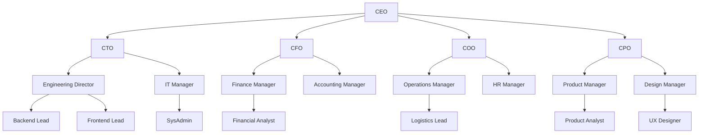
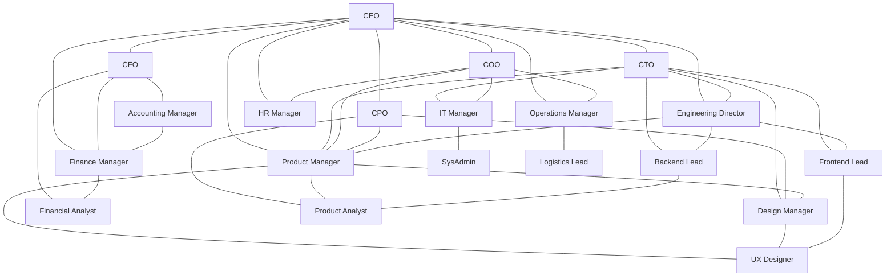
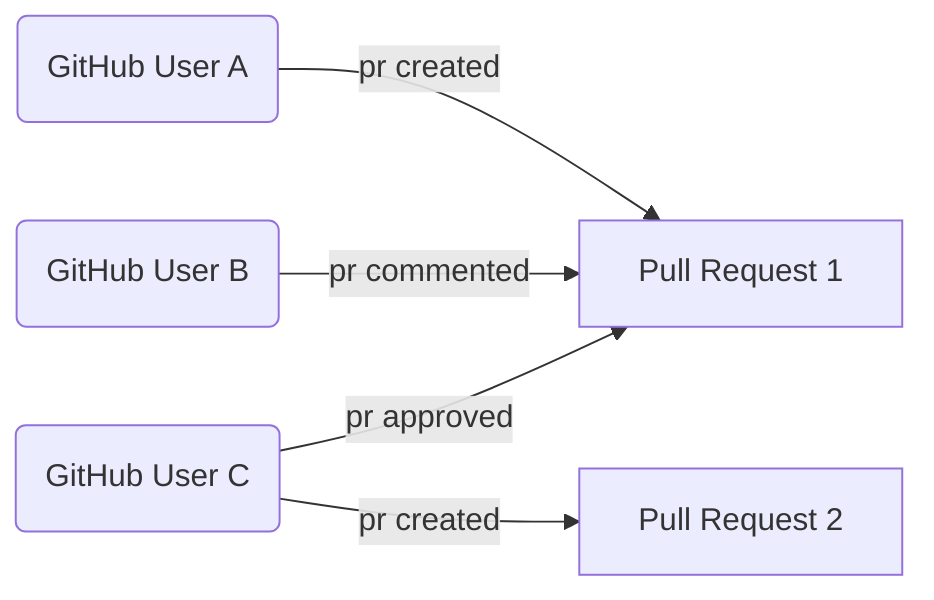
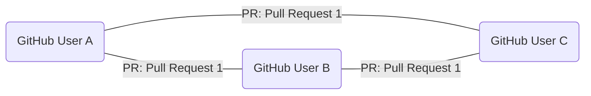

---
# try also 'default' to start simple
theme: default
# background: https://cover.sli.dev
# some information about your slides (markdown enabled)
title: What Engineering Leaders Can Learn from Social Network Analysis
info: |
  Presentation slides for What Engineering Leaders Can Learn from Social Network Analysis.

class: text-center
drawings:
  persist: false
# slide transition: https://sli.dev/guide/animations.html#slide-transitions
transition: slide-left
# enable Comark Syntax: https://comark.dev/syntax/markdown
comark: true
# duration of the presentation
duration: 20min
---

# Social Network Analysis for Engineering Leaders

---
transition: fade-out
---

# Who am I and why Social Network Analysis?
 
 

### - Became a Senior Engineering Manager at GitHub in 2024
### - Software Engineer in various leadership roles for over a decade. 

 
 

## Also...

 
 

### - Sociologist and Anthropologist 
### - Researched Social Networks in Social Media and Community Language Usage
### - Arabic Linguist (لسا بقدر احكي)

---
transition: fade-out
---

# What we'll cover

1. Using Social Network Analysis to understand teams and organizations
2. Practical team management insights derived from Social Network Analysis
3. Explore the limits of Social Network Analysis

---
transition: fade-out
layout: center
class: text-center
---

# Social Network Analysis for Understanding 
# Teams and Organizations

---
transition: fade-out
---

# Understanding Teams and Organizations

 

<!--

- Influencers and Connectors - people who are the center and those that connect different groups together.
- Group dyamics that are not visible in the organizational chart.
- Interpersonal Connections that are not broadcast - for example, a silent contributors that works via 1-1s vs group meetings.
-->

---
transition: fade-out
---

# What can we learn with SNA in a work context?

 

---
theme: default
drawings:
  persist: false
transition: slide-left
comark: true
class: text-center
---

# How I applied Social Network Analysis

---
transition: fade-out
---

# Data Collection and Processing

- Started collecting data using a script similar to [gh-graph-explorer](https://github.com/geramirez/gh-graph-explorer) in January 2024. 
- Stored data in an csv edge list (usernames -- interaction -- GitHub Resource)
- Removed data points considered "fake collaboration" like weekly standup reports.
- At first clean up bots... but then decided to leave them. (hubot, dependabot, slack integrations, etc)

 

---
transition: fade-out
class: text-center
---

# Building The Network
 

## Bipartite Network

---
transition: fade-out
class: text-center
---

# Building The Network

 

## Collapsed Bipartite Network

 

---
transition: fade-out
---

# Visualizing The Network

- Tools like [Gephi](https://gephi.org/), [vis-network](https://github.com/visjs/vis-network), [Cosmograph](https://cosmograph.app/), and [Neo4J](https://neo4j.com/)

 

---
transition: fade-out
---
# Network Analysis
- Took bi-weekly measurements of the number of nodes, connectivity, and density of the network.

 

---
transition: fade-out
---

# Practical Team Management Insights

 

1. Team On and Offboardings
2. Cliques and Silos
3. The Seniority Bottleneck
4. Manager Bottlenecks

---
transition: fade-out
---

# Team On and Offboardings

<!--
- it’s well documented that adding or removing people from a team affects team velocity.
- From the network perspective, something similar happens, the social network can also become more fragmented.
- I didn't start collecting on these people until 2-3 weeks after they joined
-->

---
transition: fade-out
---

# Team On and Offboardings Mitigations

- Buddy system 
- Onboarding Round Robins
- Question of the Day or Game Days

<!--

- Buddy system - help people find someone to talk to 
- Onboarding Round Robins Build onboarding guide that requires 1-1s with team mates
-  Question of the Day or Game Days  - Allow for relationship building rather than just pushing people into a silo

-->

---
transition: fade-out
---

# Cliques and Silos

 

<!--
- Cliques and silos are when a group of people form tight-knit subgroups. 
- the Picture shows two of these silos
--> 

---
transition: fade-out
---

# Cliques and Silos Mitigations

- Are cliques and silos bad?
- When It's Positive - Encourage it let it be. Allow deep connections and work.
- When It's Detrimental - Rotations, cross-team projects, mob sessions

 

<!--
- These network proprties can be good or bad
- Bad: only a few people have information 
- Good: people are working very well together and sharing the load with a group of people
- They can also demonsrate a period of Sepicalized work or lack of cliques can show a period of Generalized work
- They can also be a sign of Deep work vs Cross-team work
--> 

---
transition: fade-out
---

# The Seniority Bottleneck

 

<!--
- senior engineers have richer networks: they have been at the organization, find it easier to reach out to others, or have more confidence when reviewing PR
- Their strong social ties are an asset, but they can also make it difficult for more junior engineers to meaningfully participate.
- Over the last two years, I tried a number of social experiments to nudge engineers closer together.
-->

---
transition: fade-out
---

# The Seniority Bottleneck Mitigations

- Mob Sessions
- Creating Junior-only Task Forces

 

<!--
 allows juniors to build confidence, practice leadership and communication in a safer environment and a smaller scale. 
- Setting up Mob programming sessions: an easier way to generate group conversations and communication especially when you have an engaging facilitator
-->

---
transition: fade-out
---

# Manager Bottlenecks

<!--
- sometimes the bottleneck can be a manager. 
- it's complicated because managers tend tob
-->

---
transition: fade-out
---

# Manager Bottlenecks Mitigations

- Encourage Autonomous Decisions 
- Delegate Meeting Leadership 
- Encourage Continuity

<!--
- Encourage Autonomous Decisions   - can be hard to let go of
- Delegate meeting leadership - for example mob sessions or retros
- Encourage Continuity - if I'm not there, continue the meeting isn't about the manager it's about the team.
-->

---
transition: fade-out
---

# Can we automate Social Network Analysis with AI?

  
  
  

<!--
Yes, we can use AI to automate the process of collecting, analyzing, and visualizing social network data.
- Neo4J has a graph database that can be used to store and query social network data
- Model Context Protocol (MCP) can be used to provide context to the AI 
- Claude Desktop can be used to interact with the AI and get insights from the data
-->

---
transition: fade-out
---

# Engineer Manager Claude

---
transition: fade-out
---

# Engineer Manager Claude

---
transition: fade-out
---

# Pause

---
transition: fade-out
---

# Thinking before leaping

<!--
- For anyone that has done softare engineering with AI, you know that building complexity is easier than ever. 
- In the recent past when you had to manually code line by line, you had time to think about if the thing your building makes sense. 
- The same applies in this case. Using AI to automate difficult managerial tasks is becoming easier.
- But we should pause and think about the implications, ethics, and limits of what we are doing. 
-->

---
transition: fade-out
class: text-center
layout: center
---

# Limits of Social Network Analysis

---
transition: fade-out
---

# The Network Needs a Manager

Social Network Analysis clarifies a snapshot of interactions. It doesn't tell you why or what to do about it.

- 1-1s: surface topics that can't be graphed
- Retrospectives: help us decide what should happen
- Coaching and Mentorship: requires interpersonal connection and trust

 

<!-- 
Without context, interpreations are worthless. SNA is not a shortcut to understanding your team. 
-->

---
transition: fade-out
---

# Performance Metrics? 
 

XKCD. (2013). "Impostor". XKCD. https://xkcd.com/149/

<!--
- With these insights, it can be tempting to turn social network analysis into a performance metric
- especially when we can easily use computational methods to calculate things like how central a person is to the network
-->

---
transition: fade-out
---

# Context Matters

### Reasons for High Connectedness
- Leader
- Glue work
- Low value work

 

### Low Connectedness and Isolation Reasons
- Vacation
- Deep Work and Research 
- Personal Issues 

<!-- 
Low connectedness and isolation can have so many different interpretations and the tools we need to apply are rarely performance management.

1. People are on vacation: this can be positive, having a person who is a central node go on a two-week vacation can give the space for new connections to form.
2. People are working through something personal: as managers, if we see an isolated individual we should be curious first and see if we can support them 
3. Other reasons include burnout, wrong fit, or lack of skills: noticing a person is isolated is only the first step, we still need our other tools like 1:1s, coaching to navigate difficult situations
-->
 

---
transition: fade-out
---

# Performance Metrics or Leadership Report Cards?

<!--
If anything it's a performance metrics for us as leaders. Are we being good team custodians?
-->

---
transition: fade-out
layout: center
class: text-center
---

# How to get Started with Social Network Analysis?

---
transition: fade-out
---

# [geramirez/gh-graph-explorer](https://github.com/geramirez/gh-graph-explorer?tab=readme-ov-file#installation)

 

---
transition: fade-out
---

# [Obsidian Graph View](https://obsidian.md/help/plugins/graph)

Using links you can map out connections during 1-1s, team meetings, or retrospectives.

<!--
This is how early anthropologist used to collect data
-->

---
transition: fade-out
---

# Observation and Listening

- Who do people go to when they're stuck?
- Who always seems to know what's happening across teams?
- Who is the last person to learn about important decisions?

<!--

- Anthropologists mapped social structures by watching and listening 
- Best leaders are aware of the social networks around them.
- If you can answer these questions your well on your way. 
- Hopefully this talk gives the framing to understand what's happening

-->

---
transition: fade-out
---

# What we covered

1. Using Social Network Analysis to understand teams and organizations
2. Practical team management insights derived from Social Network Analysis
3. Explore the limits of Social Network Analysis

---
transition: fade-out
---

# Thank you!
